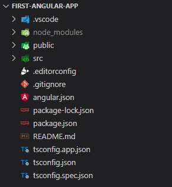
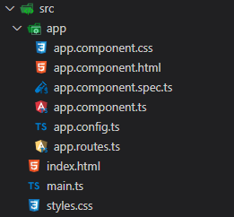

# **Angular Fundamentals** <!-- omit in toc -->

This section will guide you on how to get started with the project on your local machine.

- [**Installing Pre-requisites**](#installing-pre-requisites)
  - [**Installing Node.js:**](#installing-nodejs)
- [**Setting Up Your Angular Project**](#setting-up-your-angular-project)
  - [**Installing Angular CLI Globally**](#installing-angular-cli-globally)
  - [**Creating a New Project**](#creating-a-new-project)
- [**Understanding Your Angular Project's Folder Structure**](#understanding-your-angular-projects-folder-structure)
  - [**Understanding Variations:**](#understanding-variations)
  - [**High-Level Overview:**](#high-level-overview)
  - [**Delving Deeper into the src folder:**](#delving-deeper-into-the-src-folder)
- [**Bringing Your Angular App to Life: How Content is Displayed**](#bringing-your-angular-app-to-life-how-content-is-displayed)
  - [**The Bootstrapping Process:**](#the-bootstrapping-process)
  - [**Putting it All Together:**](#putting-it-all-together)


## **Installing Pre-requisites**

Before diving into the exciting world of Angular, let's set up your development environment. Here's what you'll need:

- **Node.js (LTS version):** This is the foundation for running Angular applications. Head over to the official website: Node.js official website and download the **latest Long-Term Support (LTS)** version. LTS versions are generally more stable and receive security updates for a longer period.
- **npm (or yarn):** npm (Node Package Manager) comes bundled with Node.js and is used to install and manage dependencies for your Angular project. You can also use yarn, another popular package manager, if you prefer.
- **Code Editor:** You'll need a code editor to write your Angular code. Popular options include Visual Studio Code (VS Code), Atom, or Sublime Text. These editors often have plugins and extensions specifically designed for Angular development, making your workflow smoother.

**[⬆️ Back to Top](#getting-started)**

### **Installing Node.js:**

1. Once you've downloaded the Node.js installer, follow the on-screen instructions to complete the installation.
2. Open your terminal (also known as command prompt). You can usually find this application by searching for "Terminal" or "Command Prompt" in your start menu.
3. Verify the installation by typing the following command in your terminal and pressing Enter:
  ```bash
    node -v
  ```
This command should display the version of Node.js installed on your machine. If you see a version number, congratulations! You're good to go.

**Additional Notes:**

- Make sure to check the "Add Node.js to PATH" option during installation. This allows you to run Node.js commands from anywhere in your terminal.
- If you encounter any issues during installation, refer to the official Node.js documentation for troubleshooting tips: Node.js Installation documentation

Now that you have the essential tools installed, let's move on to creating your first Angular project!

**[⬆️ Back to Top](#getting-started)**

## **Setting Up Your Angular Project**
Now that you have the development environment ready, let's create your first Angular project!

**[⬆️ Back to Top](#getting-started)**

### **Installing Angular CLI Globally**

The Angular CLI (Command Line Interface) is a powerful tool that helps you quickly generate projects, build and serve applications, and manage dependencies. To install it globally using npm, open your terminal and run the following command:

```bash
npm install -g @angular/cli
```
This command downloads and installs the Angular CLI globally on your machine. Once finished, verify the installation by running:

```bash
ng --version
```

The terminal should display the installed version of the Angular CLI.

**[⬆️ Back to Top](#getting-started)**

### **Creating a New Project**

1. Choose Your Project Directory:  Navigate to the directory where you want to create your new Angular project using the cd command in your terminal.
2. Generate a New Project:  Run the following command, replacing project-name with the desired name for your project:

```bash
ng new project-name
```
The Angular CLI will prompt you with some configuration options. Here's a breakdown of what each option means:

- **Stylesheet Format:** Choose the stylesheet format you prefer for your project. Popular options include CSS (default), SCSS, SASS, LESS, or Stylus. Select the option that best suits your needs.
- **Server-Side Rendering (SSR) and Static Site Generation (SSG/Prerendering): **These are advanced features you can enable later. For now, you can usually leave them disabled by pressing Enter.
3. **Navigate to Project Directory:** Once the project setup is complete, navigate to the newly created project directory using the cd command:
4. **Start the Development Server:** Run the following command to start the development server:

```bash
ng serve
```
This command starts a local development server that builds and runs your Angular application.

5. **View Your Application:** Open your web browser and navigate to http://localhost:4200/. You should see the default Angular welcome screen displayed, indicating your project is running successfully!
Congratulations! You've just created and set up your first Angular project. Now it's time to explore the exciting world of Angular application development!

**[⬆️ Back to Top](#getting-started)**

## **Understanding Your Angular Project's Folder Structure**

The structure of your Angular project's files plays a crucial role in organizing your code and keeping things maintainable. Let's explore the different folders and their purposes:

**[⬆️ Back to Top](#getting-started)**

### **Understanding Variations:**

It's important to note that the folder structure might slightly differ based on the Angular CLI version you used to create the project. The following breakdown focuses on a project created with Angular CLI version 18.x.

**[⬆️ Back to Top](#getting-started)**

### **High-Level Overview:**

- `.vscode` (Optional): This folder contains pre-configured settings for Visual Studio Code, a popular code editor for Angular development.
node_modules: This folder houses all the external libraries and dependencies needed for your project to function. These are installed using npm install.
public: This folder holds static assets like your project's favicon (favicon.ico).
- `src`: This is the heart of your project, containing the source code for your Angular application.
- `.editorconfig`: This file defines coding style guidelines to ensure consistency across different editors.
- `.gitignore`: This file specifies files (e.g., compiled files) that should be excluded from version control using Git.
- `angular.json`: This configuration file manages various aspects of your Angular project, including styles, scripts, assets, and build settings.
- `package.json`: This file holds essential project metadata and lists all the dependencies required to run your application.
- `README.md`: This file provides documentation about your project, including setup instructions.
- `tsconfig.*` files: These TypeScript configuration files define how the TypeScript compiler processes your code for different purposes (application, tests, etc.).

  

**[⬆️ Back to Top](#getting-started)**

### **Delving Deeper into the src folder:**

This folder is the core of your Angular application's code. Here's a breakdown of its key components:

---

- `app`: This folder contains the root component, the starting point of your Angular application. It includes:
  - `app.component.*` files: These files define the root component's behavior (.ts), visual template (.html), styles (.css), and unit tests (.spec.ts).
  - `app.config.ts`: (Optional) This file can hold configuration settings specific to your application.
  - `app.routes.ts`: (Optional) This file defines the routing configuration for your application's different views.
- `index.html`: This is the main HTML file that serves as the entry point for your Angular application in the browser.

- `main.ts`: This is the main TypeScript file responsible for bootstrapping the Angular application.

- `styles.css`: This file defines global styles that apply to your entire Angular application.
  

Remember, this is a general structure, and you might encounter additional folders or files as your project grows. However, understanding these core components provides a solid foundation for navigating your Angular project effectively.

**[⬆️ Back to Top](#getting-started)**

## **Bringing Your Angular App to Life: How Content is Displayed**

Angular applications are built with modular components, each responsible for a specific piece of functionality or UI element. Here's a breakdown of how content is displayed and components work together:

Components are the Building Blocks:

Imagine your Angular application like a Lego set. Each component is like a Lego brick, containing its own logic, visuals, and styles. By combining these components, you create the overall structure and functionality of your application.

**[⬆️ Back to Top](#getting-started)**

### **The Bootstrapping Process:**

1. `index.html`:   This is the main HTML entry point for your application in the browser. It acts like the blueprint for the initial layout. Here, you'll find a tag with a specific selector (e.g., <app-root>). This tag serves as a placeholder for where your main component will be rendered.
2. `app.component.ts`:   This TypeScript file defines the root component, the foundation of your application. It's decorated with the @Component decorator, which provides essential information about the component.
   - `selector`: This property matches the selector tag used in index.html (e.g., app-root). It tells the Angular compiler where to inject the component's content.
   - `templateUrl`: This points to the HTML template file (app.component.html) that defines the visual structure of the component.
   - `styleUrls`: (Optional) This can specify the path to a CSS file (app.component.css) containing styles specific to the component. These styles are encapsulated and don't affect other components.
3. `main.ts`: This is the main entry point for your Angular application's TypeScript code. It acts like the conductor, orchestrating the entire application. Here's what happens:
   - The bootstrapApplication method from @angular/platform-browser is imported.
   - It takes the AppComponent as input (the root component we defined earlier).
   - This method essentially finds the selector tag (<app-root>) in index.html and replaces it with the content defined in the AppComponent's template (app.component.html).

**[⬆️ Back to Top](#getting-started)**

### **Putting it All Together:**

When you run your Angular application, the Angular CLI kicks in behind the scenes. It takes your TypeScript code, compiles it into JavaScript, and ultimately renders the components and their content in the browser.

This is a simplified view of how Angular applications work. As you delve deeper, you'll explore more advanced concepts like data binding, routing, services, and more. But understanding this foundational concept of components and bootstrapping is crucial for building your first Angular application!

**[⬆️ Back to Top](#getting-started)**

---

<div style="display: flex; justify-content: space-between">
    <a></a>
    <a href="../README.md"><b>🏠 Go Home</b></a>
    <a href="./3.%20Managing%20State%20and%20Updates.md"><b>Managing State and Updates ➡️</b></a>
</div>

---