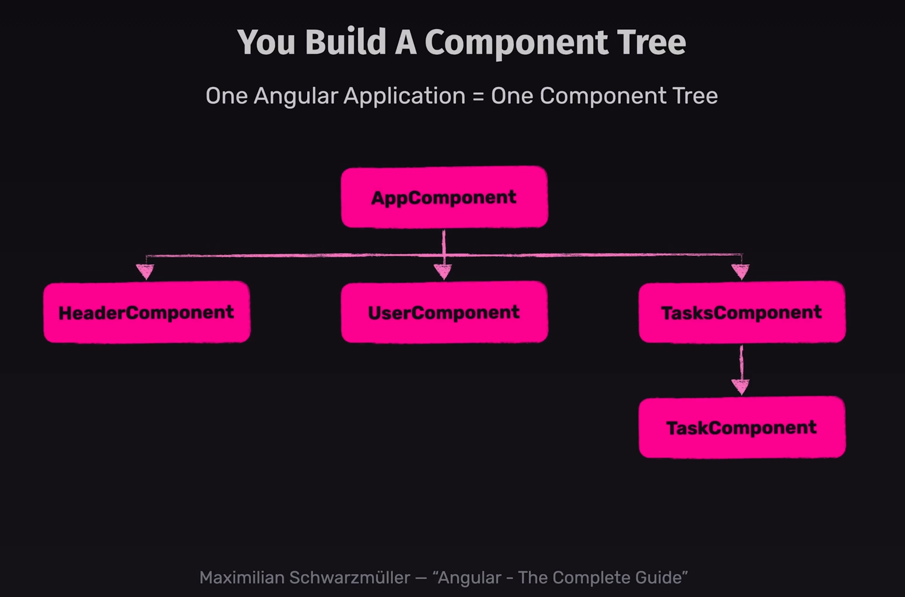

# **Angular Basics** <!-- omit in toc -->

This section will guide you on the basics of Angular.

- [**Building Blocks: Angular Components**](#building-blocks-angular-components)
  - [**What is a Component?**](#what-is-a-component)
  - [**Creating Your First Component:**](#creating-your-first-component)
  - [**Using a Component:**](#using-a-component)
  - [**Styling a Component**](#styling-a-component)
- [**Assets**](#assets)
- [**Dynamic Data**](#dynamic-data)
  - [**Interpolation:**](#interpolation)
  - [**Property Binding:**](#property-binding)
  - [**Getters and Setters:**](#getters-and-setters)
  - [**Event Binding**](#event-binding)
- [**Exercise**](#exercise)


## **Building Blocks: Angular Components**
In Angular, components are like the Lego bricks that make up your application's user interface. Each component encapsulates a specific functionality or UI element, promoting modularity and reusability. Here's a breakdown of components and how to create them:

### **What is a Component?**

Imagine a button, a form, or a product card in your Angular application. Each of these could be a component. It's essentially a TypeScript class decorated with @Component to provide metadata about its behavior and appearance. This metadata instructs Angular how to create and display the component.

### **Creating Your First Component:**

Let's walk through creating a simple component named HeaderComponent:

1. **File Creation:** Navigate to the src/app folder in your terminal and use your preferred code editor to create a new file named header.component.ts.

2. **Define the Class:**  Inside this file, define a TypeScript class named HeaderComponent and mark it as export. This makes the component accessible from other parts of your application.

3. **The @Component Decorator:** Add the @Component decorator from @angular/core to the HeaderComponent class. This decorator tells Angular that this class is an Angular component.

4. **Component Configuration:** Inside the @Component decorator, pass an object to configure the component's behavior:

   - `selector`: This property defines a unique CSS selector (e.g., app-header) that represents this component in your templates. It acts like a tag name for the component.
   - `template`: This property specifies the HTML template that defines the visual structure of the component. In our example, we'll set it to a simple paragraph indicating the component is working.
   - `standalone`: This property specifies whether the component is standalone or not. A standalone component is a component that doesn't have any dependencies on other components.

Here's the code snippet for your header.component.ts file:

```typeScript
import { Component } from '@angular/core';

@Component({
  selector: 'app-header',
  template: `<p>header works!</p>`
})
export class HeaderComponent { }
```

***Note:*** 
- It is a good practice to name your component files with a .component.ts extension to distinguish them from other files.
- The component's selector should be unique to avoid conflicts with other components. You can prefix it with app- to indicate it's a part of your application. This is a common naming convention in Angular and helps prevent selector collisions from either HTML elements or other libraries.
- If your component is split into multiple files (e.g., HTML, CSS, TypeScript), you can use the templateUrl and styleUrls properties to link to these files. Additionally you can also store these files in a separate folder named new.
- You can also create a component using the Angular CLI by running the following command:

```bash
ng generate component header
# or shorthand
ng g c header
```

This will create a new folder named header in the src/app directory with the necessary files for the component. This is the recommended way to create components in Angular as it follows best practices and saves you time and errors in setting up the component.


### **Using a Component:**

**With your basic component defined, you'll typically need to:**

- Import and use the component in your main application component (app.component.ts) to display it on the screen.

```typeScript
import { Component } from '@angular/core';
import { HeaderComponent } from './header/header.component';

@Component({
  selector: 'app-root',
  imports: [HeaderComponent], // Import the HeaderComponent
  templateUrl: './app.component.html',
})
export class AppComponent { }
```

- Add the component's selector (app-header) to the app.component.html file to render it in the browser.

```html
<app-header></app-header>
```

By understanding components and their creation process, you're laying the foundation for building interactive and dynamic Angular applications!

---
[⬆ Back to Top](#angular-basics)

### **Styling a Component**

There are multiple ways you could style your Angular components. Here are a few common methods:

1. **Inline Styles:** You can use the `styles` property in the @Component decorator to add inline styles to your component. This is useful for small style changes or when you want to keep the styles close to the component's code.

```typeScript
...
@Component({
  ...
  styles: [`p { color: red; }`]
})
...
```

2. **External Styles:** If you have a lot of styles or want to keep your styles in a separate file, you can use the `styleUrls` property in the @Component decorator to link to one or more external CSS files.

```typeScript
...
@Component({
  ...
  styleUrls: ['./header.component.css']
})
...
```
**Note:** Since Angular 17+, you can also use `styleUrl` instead of `styleUrls` to link to a single CSS file.
```typeScript
styleUrl: './header.component.css'
```

3. **Global Styles:** If you want to apply styles globally across your application, you can add them to the styles.css file in the src folder. Angular automatically includes this file in the index.html file, making it a great place for global styles.

```css
/* styles.css */
p { font-size: 16px; }
```
This will apply the font-size of 16px to all paragraph elements in your application unless overridden by more specific styles.

4. **CSS Preprocessors:** If you prefer using CSS preprocessors like Sass or Less, Angular supports them out of the box. You can create .scss or .less files and import them into your components using the styleUrls property.

```typeScript
...
@Component({
  ...
  styleUrls: ['./header.component.scss']
})
...
```

Note: Angular CLI asks you to choose a CSS preprocessor when creating a new project. If you didn't choose one during project creation, you can add it later using the Angular CLI.

```bash
ng config defaults.styleExt=scss
```
For additional information on styling Angular components, refer to the official Angular documentation on [Component Styles](https://angular.dev/guide/components/styling).

---
[⬆ Back to Top](#angular-basics)

## **Assets**

In Angular, assets are files that are not TypeScript, CSS, or HTML files. These include images, fonts, and other resources that your application needs. Here's how you can use assets in your Angular project:

1. **Adding Assets:** Place your assets in the src/assets folder. This folder is the default location for assets in an Angular project. You can create subfolders within the assets folder to organize your assets.
2. **Configuring `angular.json`:** To ensure that Angular includes your assets when building the application, update the assets array in the angular.json file. This file is located in the root of your Angular project and contains configuration settings for your project.

```json
"assets": [
  "src/favicon.ico",
  "src/assets"
]
```

3. **Referencing Assets:** To reference an asset in your application, use the relative path from the assets folder. For example, if you have an image named logo.png in the assets/images folder, you can reference it in your component's template like this:

```html

```
4. **Adding Fonts:** If you want to load an external font (e.g., a Google Font) in your Angular application, you can add the font link to the `index.html` file in the src folder. This will make the font available to all components in your application.

```html
<!DOCTYPE html>
<html lang="en">
  <head>
    <meta charset="utf-8">
    <title>MyApp</title>
    <link href="https://fonts.googleapis.com/css2?family=Roboto:wght@400;700&display=swap" rel="stylesheet">
  </head>
  <body>
    <app-root></app-root>
  </body>
</html>
```
You can then use the font in your component's styles by specifying the font-family property.

```css
/* header.component.css */
p { font-family: 'Roboto', sans-serif; }
```

You can also use font files (e.g., .woff, .woff2) in your Angular project by placing them in the assets folder and referencing them in your component's styles.


By understanding how to use assets in your Angular project, you can enhance your application with images, fonts, and other resources to create a more engaging user experience.

---
[⬆ Back to Top](#angular-basics)

## **Dynamic Data**

In Angular, you can display dynamic data in your components using interpolation, property binding, and event binding. Here's an overview of these techniques:

### **Interpolation:**

Interpolation is a way to display dynamic data in your component's template. You can use double curly braces `{{ }}` to bind a component property to an HTML element. For example, if you have a property named title in your component class, you can display it in the template like this:

```typeScript
// header.component.ts
export class HeaderComponent {
  title = 'Welcome to EasyTask';
}
```

```html
<!-- header.component.html -->
<p>{{ title }}</p>
```

When the component is rendered in the browser, Angular replaces `{{ title }}` with the value of the title property. This allows you to display dynamic content based on the component's state.

### **Property Binding:**

Property binding is another way to display dynamic data in your component's template. You can bind a component property to an HTML element's property using square brackets `[]`. For example, if you have a property named imageUrl in your component class, you can bind it to an image element's src attribute like this:

```typeScript
// header.component.ts
export class HeaderComponent {
  imageUrl = 'assets/images/logo.png';
}
```

```html
<!-- header.component.html -->

```

When the component is rendered in the browser, Angular sets the src attribute of the image element to the value of the imageUrl property. This allows you to load images dynamically based on the component's state.

### **Getters and Setters:**

In Angular, you can use getters and setters to compute and manipulate component properties. Getters are used to retrieve the value of a property, while setters are used to set the value of a property. This allows you to add logic to property access and assignment.

```typeScript
// header.component.ts
export class HeaderComponent {
  private _title = 'Welcome to EasyTask';

  get title(): string {
    return this._title.toUpperCase();
  }

  set title(value: string) {
    this._title = value;
  }
}
```

```html
<!-- header.component.html -->
<p>{{ title }}</p>
```

In this example, the title property is defined with a getter and setter. The getter returns the title in uppercase, while the setter sets the title to the specified value. This allows you to transform and validate property values before they are accessed or assigned.

### **Event Binding**

Event binding is used to listen for events in your component's template and trigger actions in response. You can bind an event to a method in your component class using parentheses `()`. For example, if you want to handle a click event on a button element, you can bind it to a method named handleClick like this:

```typeScript
// header.component.ts
export class HeaderComponent {
  handleClick(): void {
    console.log('Button clicked!');
  }
}
```

```html
<!-- header.component.html -->
<button (click)="handleClick()">Click Me</button>
```

When the button is clicked, Angular calls the handleClick method in the component class. This allows you to respond to user interactions and update the component's state accordingly.

By using interpolation, property binding, getters and setters, and event binding, you can create dynamic and interactive components in your Angular application.

---
[⬆ Back to Top](#angular-basics)

## **Exercise**

1. Create a new Angular Project using the Angular CLI.
2. Create a new component named `HeaderComponent`.
3. Add a heading with text `EasyTask` inside the HeaderComponent (Use external template).
4. Display the HeaderComponent in the AppComponent.
5. Create a new CSS file for the HeaderComponent and add styles to the heading.
6. Add image in your header by using a local image.
7. Create a new `User` component.



---
[⬆ Back to Top](#angular-basics)
